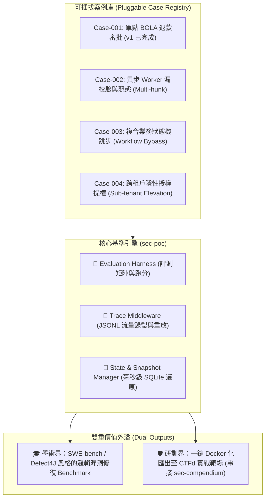

# 🏛️ 受控商業邏輯弱點與 Multi-hunk 評測基準平台轉型全景規劃 (Benchmark Platform Roadmap v1)

> **版本**：v1.0  
> **制定日期**：2026-09-19  
> **專案定位**：從單點退款 PoC 系統升級為「可插拔受控商業邏輯弱點與不可分割 Multi-hunk APR 評測基準平台（Business-Logic Vulnerability & Multi-hunk APR Benchmark Platform）」。  
> **關聯檔案**：`POC/MEMORY.md`, `controlled-test-system-concept-v1.md`, `case-selection-and-multihunk-criteria-v1.md`

---

## 🎯 一、 轉型願景與三年研究對齊 (Vision & Alignment)

原本的 `test-system/` 僅具備單一退款審批案例（BOLA 弱點），容易被視為一次性的 Toy Server。本規劃將其提升為具備標準化契約、可插拔案例庫與自動評測矩陣的 **Benchmark 平台**，同時服務學術實證與實戰研訓。



### 三年研究計畫對應關係
1. **第一年（黑箱行為推論）**：透過 `TraceEngine` 錄製標準正常與違規 HTTP 序列（JSONL），作為有限狀態機（FSM）或語意推論的輸入。
2. **第二年（代碼表示與定位）**：比對外部 Trace 與後端 AST / CPG，定位缺失的守衛條件（Missing-Guard）。
3. **第三年（自動修復 APR）**：使用 `Harness` 評測 LLM Agent 或 APR 工具生成的補丁，檢驗其修補成功率與是否引入功能回歸（Regression）。

---

## 📐 二、 標準案例契約規範 (Case Contract Specification)

所有案例統一收攏於 `cases/` 目錄下，每個案例必須滿足以下標準結構與契約，確保 Harness 能以通用方式掛載執行：

```text
cases/
├── case-001-refund-bola/               # 案例 001：單點 BOLA 退款
│   ├── meta.json                       # 案例元資料與評測規範
│   ├── src/                            # 後端業務代碼 (預設為 vulnerable 狀態)
│   ├── poc/                            # 黑箱攻擊與合法流程腳本
│   │   ├── legal-workflow.mjs
│   │   └── exploit-bola.mjs
│   ├── ground-truth/                   # 真值標準
│   │   ├── patch.diff                  # 標準 Ground Truth 補丁
│   │   └── enforcement-map.md          # 缺陷節點與守衛對齊表
│   └── test/
│       └── oracle.test.mjs             # 雙重檢驗 Oracle (漏洞阻擋 + 業務回歸)
├── case-002-async-worker-race/         # 案例 002：異步 Worker 漏校驗 (Multi-hunk)
└── ...
```

### `meta.json` 標準綱要定義

```json
{
  "id": "case-002-async-worker-race",
  "title": "複合審批異步出納之條件競爭與漏校驗",
  "cwe": ["CWE-362", "CWE-862", "CWE-841"],
  "severity": "HIGH",
  "complexity": {
    "roles": ["customer", "supervisor", "finance_worker"],
    "async_components": ["queue_worker"],
    "hunk_count": 3,
    "is_inseparable_multihunk": true
  },
  "oracle": {
    "exploit_script": "poc/exploit-race.mjs",
    "legal_script": "poc/legal-workflow.mjs",
    "test_suite": "test/oracle.test.mjs"
  }
}
```

---

## 🔬 三、 Case-002 深度架構設計（攻堅目標：不可分割 Multi-hunk）

### 1. 業務場景與漏洞機制
- **業務流程**：
  1. `customer` 建立高額退款單 (`REQUESTED`)。
  2. `supervisor` 審核並核准 (`APPROVED`)。
  3. 背景 `finance_worker` 每隔數秒從 DB 拉取 `APPROVED` 訂單執行銀行扣款出納並更新為 `REFUNDED`。
- **漏洞觸發場景（TOCTOU + Missing-Guard）**：
  - 在 Supervisor 核准後、Worker 實際出納前，系統存在可操作的時間窗口。
  - 客戶端此時發起「取消退款」或「申請重複請款」，API 端因為缺乏互斥狀態鎖而允許變更。
  - 異步 Worker 取出原本為 `APPROVED` 的任務後，**未在執行扣款前進行狀態重驗證（Missing Guard in Worker）**，導致款項照常退給客戶，造成重覆出納或已取消仍退款的嚴重財務損失。
- **二階段黑箱探詢盲區**：
  - 外部黑箱探詢工具只能觀察到 HTTP 請求與回應，**無法感知背景異步佇列的執行時序與內部狀態競爭**，傳統單點 API 測試無法檢出該弱點。

### 2. 不可分割 Multi-hunk 修補證明（Ground Truth Inseparability）
此修補必須同時跨足三個層次（Hunk 1 ~ Hunk 3），任何單獨或不完整的修補都會失敗：

| Hunk 位置 | 修補內容 | 若缺少此 Hunk 的後果 |
| :--- | :--- | :--- |
| **Hunk 1 (API 入口)** | 在申請取消或狀態變更時，加入分散式/樂觀鎖校驗，若任務已在出納佇列中則拒絕操作。 | 若只改 Worker，API 仍允許使用者操作已取消狀態，造成資料不一致。 |
| **Hunk 2 (Worker 執行端)** | 在執行扣款前，進行原子 Compare-and-Swap（`UPDATE ... WHERE id = ? AND status = 'APPROVED' AND version = ?`），若狀態已被取消則安全 Rollback。 | 若只改 API，網路延遲或高併發下仍會在 Worker 與 API 之間產生 Race Condition。 |
| **Hunk 3 (DB 狀態約束)** | 新增樂觀鎖版本號欄位 (`version`) 與狀態機移轉約束。 | 若無版本欄位與底層約束，Hunk 1 與 Hunk 2 無法保證原子性。 |

---

## 🗓️ 四、 分階段實施路線圖 (Phased Execution Roadmap)

### 📌 Phase 1：架構解耦與現有案例遷移（Pluggable Refactoring）
- [ ] **1.1 目錄重構**：
  - 建立 `cases/case-001-refund-bola/`，將目前 `test-system/` 的業務邏輯完整移入。
- [ ] **1.2 抽取 Benchmark Core**：
  - 將通用資料庫重置/快照邏輯抽離為 `core/db-manager.mjs`。
  - 將 HTTP 流量 JSONL 錄製機制抽離為通用中介軟體 `core/trace-recorder.mjs`。
- [ ] **1.3 統一 CLI Harness**：
  - 支援 `npm run bench -- --case=case-001 --verify` 等標準調度命令。
- [ ] **1.4 回歸驗證**：
  - 確保 Case-001 搬移後，所有 9 項測試依然 100% 通過。

### 📌 Phase 2：Case-002 完整實裝與 Multi-hunk 驗證
- [ ] **2.1 案例規格書定稿**：
  - 撰寫 `cases/case-002-async-worker-race/meta.json` 與詳細攻擊路徑。
- [ ] **2.2 實裝 Vulnerable 系統**：
  - 實作具備時間差之異步 Worker 與審批後退款 API。
  - 撰寫 `poc/exploit-race.mjs`，穩定重現並產出攻擊 JSONL 軌跡。
- [ ] **2.3 實裝 Fixed 系統與 Ground Truth Patch**：
  - 產出 3 個不可分割 Hunk 的真實 patch 檔案。
  - 撰寫 `test/oracle.test.mjs`，驗證全補通過、任缺一 Hunk 必失敗。

### 📌 Phase 3：自動化評測矩陣 (Evaluation Harness & Metrics)
- [ ] **3.1 外部 Patch 注入介面**：
  - 支援傳入外部 LLM 或 APR 工具生成的 `.diff` 檔案。
- [ ] **3.2 評測評分器 (Scorer)**：
  - 自動比對：(1) Exploit Blocked (2) Functional Regression Pass (3) Hunk Count & Localization Accuracy。
- [ ] **3.3 產出 Markdown / JSON 評測報表**。

### 📌 Phase 4：Docker 化與 CTFd 實戰靶場匯出
- [ ] **4.1 Dockerfile 範本**：
  - 為各案例建立獨立 Dockerfile，支援以環境變數切換 vulnerable/fixed 模式。
- [ ] **4.2 匯出至 `sec-compendium`**：
  - 提供腳本將案例一鍵轉出為 CTFd 題目包（含題目說明、附件、動態 Flag 機制）。

---

## 🛡️ 五、 執行安全與原子化提交守則 (Strict Atomic Commits Discipline)

為了確保代碼庫具備高工程水準、可追溯性與可獨立 Cherry-pick / Revert 能力，本專案實施**嚴格的原子化提交紀律**：

### 1. 嚴格區分不同脈絡（Context Separation Invariant）
**絕對禁止**將不同技術脈絡或意圖的改動混在同一個 Commit 中。每次提交必須歸屬於單一且明確的脈絡：
- 📦 **檔案純搬移／重構結構 (`refactor`/`chore`)**：純粹的目錄調整或檔案移動（Pure file moves/renames），**不得**與內容代碼修改混在一起。
- ⚙️ **核心架構抽取 (`refactor`)**：抽離共用核心函式庫（如 `core/db-manager.mjs`），不與特定案例業務邏輯混在一起。
- 🧩 **單一案例邏輯實作 (`feat`/`fix`)**：只針對單一案例進行功能擴充或漏洞修復，各案例之間彼此隔離。
- 🧪 **測試與驗證斷言 (`test`)**：測試案例撰寫、驗證腳本與 Oracle 實作，獨立於業務功能代碼。
- 📝 **文檔與知識庫更新 (`docs`)**：Roadmap、RFC、README 與 MEMORY.md 的修改，獨立提交。
- 🛠️ **工具與 CI/CD 配置 (`chore`/`ci`)**：套件依賴 (`package.json`)、設定檔與流水線異動，獨立提交。

### 2. 單一功能原則與「可還原性檢驗」(The Revert Test)
- **單一目的（Single Purpose）**：每個 Commit 僅能達成一個可獨立驗證的目標。
- **Revert Test 檢驗標準**：在提交前自我檢查——*「如果這筆 Commit 被單獨 `git revert`，是否會意外破壞或帶走其他不相干的功能？」*
  - 若答案是「會」，則表示打包了多個意圖，**必須拆解**。

### 3. 分塊暫存紀律（Chunk / Hunk Level Staging）
- 若一個檔案內同時包含格式整理（Formatting）、型態修正與新功能，**必須使用 `git add -p` 拆解**，禁止盲目 `git add .`。
- 禁止「一次大包裹提交（Mega-commits）」：即便是同一個 Phase，也必須依照「介面定義 → 核心實作 → 測試斷言」切分為 2~4 個原子 Commit。

### 4. 品質保證與狀態持續驗證
- **驗證不可中斷**：每個業務或重構 Commit 完成後，本地必須執行 `npm run verify`，確保提交歷史上的任一點都是綠燈可編譯、可通過測試的穩定狀態。
- **持續記憶體同步**：每個階段性任務結束前，即時更新 `MEMORY.md`。

